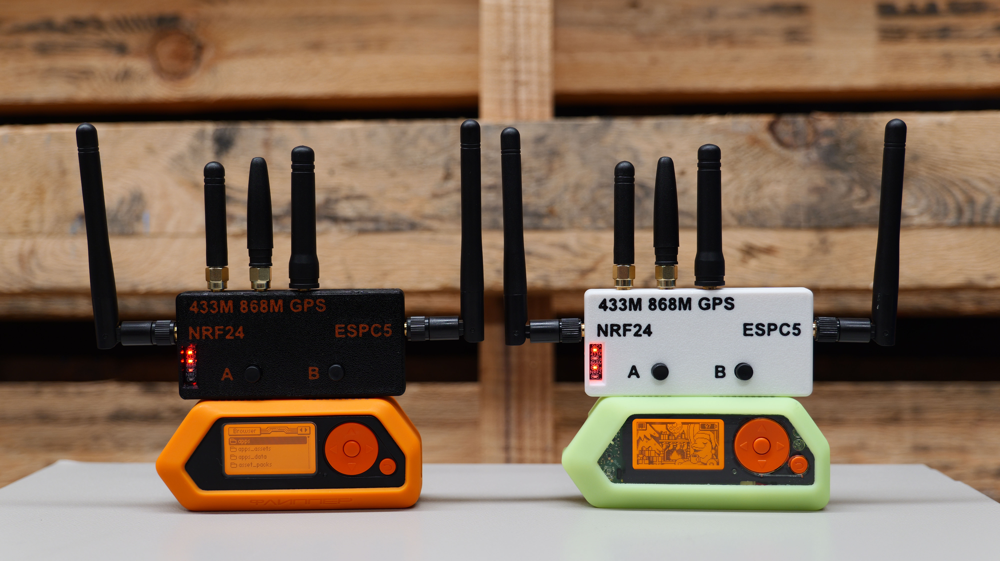
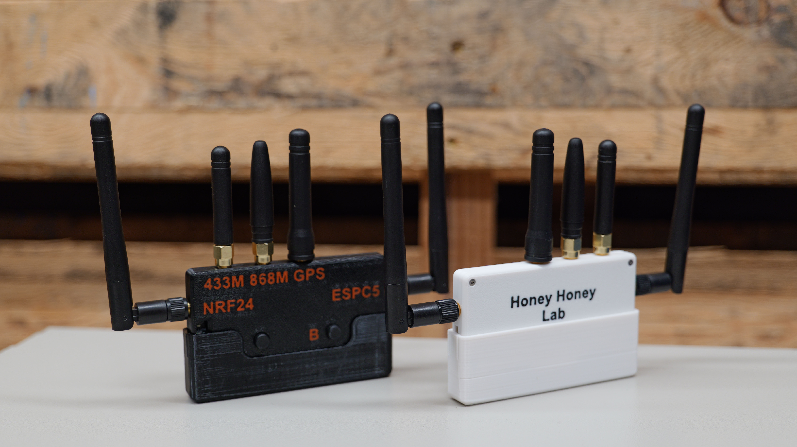
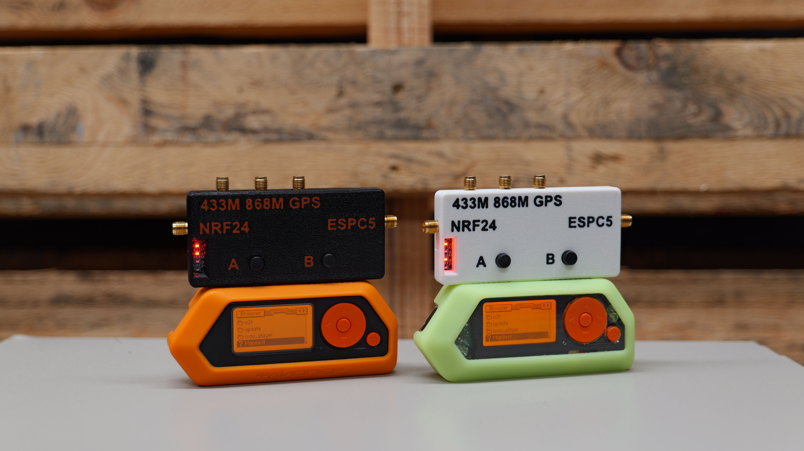

# ESP32 Marauder 5G - Apex 5 Module - User Manual 

> [!NOTE]
> - Batch 1 units will be available to order on Tindie from 12 Feb 2026 and are scheduled to ship on Friday, 15 Feb 2026.
>   
> - 09 Feb 2026 — First version of this manual, by Anson C. @ Honey Honey Team
>
> - Batch 1 of the APEX 5 module does not support Marauder WarDrive. If WarDrive is essential for your application, please wait for Batch 2.
> 
> - All procedures and descriptions related to the Flipper Zero in this manual were validated using Momentum Firmware version MNTM-012 (30-04-2025).

 

  ## 1. What is Apex 5 Module
	
Apex 5 Module is Our latest creation for Flipper Zero. The 5 is **stand for 5 major functionality on board**, vastly extend the capability of flipper Zero. 
	
- ⚡ **ESP32-C5** running **Marauder** firmware, capable of handling **2.4GHz + 5GHz WiFi**
- ⚡ **Dual Sub-GHz modules** supporting **433MHz** and **868MHz** frequencies
- ⚡ **NRF24 Chipset** capturing, analysing, and transmitting raw 2.4GHz packet data
- ⚡ **Built-in GPS**
	
## 2. What Makes Apex 5 Module Special?
  
1️⃣ **Comprehensive & Powerful**

The **Apex 5 Module** combines the most popular expandable functionalities for the Flipper Zero into one compact and portable device. 
	
Compared to our **Double Barrel 5G** unit, the Apex 5 trims down to a single Marauder setup while still **retaining full 5GHz WiFi capability**. On top of that, it also integrates:
- ✅ Dual Sub-GHz modules
- ✅ NRF24 support

 

2️⃣ **User-friendly**

We designed Apex 5 not just for performance, but for ease of use:
- ✅ **Marauder firmware comes preloaded** — ready to use out of the box
- ✅ **Well-written manuals and demo videos** (just like our other products)
- ✅ **Responsive technical support** via WhatsApp and email

Whether you're new or experienced, you can get started quickly and confidently.

 

## 3. Specification

- 🌟 **Genius ESP32-C5 chipset** featuring ESP32 Marauder firmware with **5 GHz WiFi support**
  - 🔸 **8MB ram & 8MB flash** version for longevity / Upgradability
  - 🔸 **SDXC card slot** for saving PCAP and log files from Marauder (optional storage)
  - 🔸 **External antenna** for improved signal performance
  - 🔸 PCAP and log files can also be saved directly to the **Flipper SD card**
  - 🔸 **USB-C port and Boost Bottom** for upgrading firmware purpose (right-side button “B”)		

- 🌟 **Dual Sub-GHz chipset** with individual LED indicators
  - 🔸 One Sub-GHz chipset dedicated to **433 MHz**
  - 🔸 One Sub-GHz chipset dedicated to **868 MHz**
  - 🔸 **1 bottom** for switching between 433 and 868mhz Frequency (Left bottom / A)
  - 🔸 **2 LEDs** to indicate which frequency is currently active
  - 🔸 **Dual antennas** for optimal signal performance
 
- 🌟 **nRF24 chipset**
  - 🔸 Controlled via the **Flipper Zero app** (Channel Scan, MouseJacker, Scan, Sniffer, and other scripts)
  - 🔸 **Led indicator**
  - 🔸 **External antenna**
    
- 🌟 **GPS module** with external antenna
  
- 🌟 **Fully assembled 3D-printed enclosure** (pre-installed)

 

	
## 4. Package List / What’s Included
- 🔸  1 × Apex 5 Module
- 🔸  Pre-installed 2-piece 3D-printed enclosure (available in black or white)
- 🔸  **5 × Antennas** (please refer to Photo 3 for antenna types and their purposes)
- 🔸  **1 × Quick-start note** to help you get started and our contact for warrenty and technical suppoort

 

## 5.  Link to purhcase
- 🔸  Our Tindie shop - (Direct Purchase link)[https://www.tindie.com/products/honeyhoneytrading/esp32-marauder-5g-apex-5-module-for-flipper/]
- 🔸  Our Official Shopify shop - Direct Link (In Progress)

 

	
## 6. Demo videos
- 🔸 **Introduction to the Apex 5**, including initial setup, a quick Marauder walkthrough, and a demo of the dual Sub-GHz functions. (Video will be available before product shipping.)
- 🔸 **How to update Marauder firmware** on the ESP32-C5 chipset

 

	
## 7. Initial Setup Guide (First-Time Use)
**Written guide in progress**. Most of this topic is covered in the “**Introduction to the Apex 5**” video, and the written guide will serve as a supplementary reference.
Estimated release of the first version: before 15/02/2026

 

## 8. How to Use Marauder Firmware & How to Update the Firmware (Written Guide)
Written guide in progress. Most of this topic is covered in the “How to Update Marauder Firmware” video, and the written guide will serve as a supplementary reference.
Estimated release of the first version: before 15/02/2026

 

## 9. How to Utilize Sub-GHz (Written Guide)
**Written guide in progress**. Most of this topic is covered in the “**Introduction to the Apex 5**” video, and the written guide will serve as a supplementary reference.
Estimated release of the first version: before 15/02/2026

 

