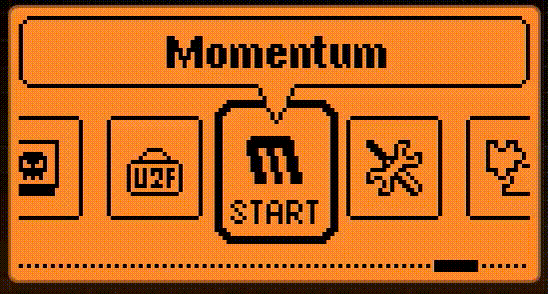

# ESP32 Marauder 5G - Apex 5 Module - User Manual 

> [!NOTE]
> - Batch 1 units will be available to order on Tindie from 12 Feb 2026 and are scheduled to ship on Friday, 15 Feb 2026.
>   
> - 09 Feb 2026 — First version of this manual, by Anson C. @ Honey Honey Team
>
> - Batch 1 of the APEX 5 module does not support Marauder WarDrive. If WarDrive is essential for your application, please wait for Batch 2.
> 
> - All procedures and descriptions related to the Flipper Zero in this manual were validated using Momentum Firmware version MNTM-012 (30-04-2025).

 

  ## 1. What is Apex 5 Module
	
Apex 5 Module is Our latest creation for Flipper Zero. The 5 is **stand for 5 major functionality on board**, vastly extend the capability of flipper Zero. 
	
- ⚡ **ESP32-C5** running **Marauder** firmware, capable of handling **2.4GHz + 5GHz WiFi**
- ⚡ **Dual Sub-GHz modules** supporting **433MHz** and **868MHz** frequencies
- ⚡ **NRF24 Chipset** capturing, analysing, and transmitting raw 2.4GHz packet data
- ⚡ **Built-in GPS**
	
## 2. What Makes Apex 5 Module Special?
  
1️⃣ **Comprehensive & Powerful**

The **Apex 5 Module** combines the most popular expandable functionalities for the Flipper Zero into one compact and portable device. 
	
Compared to our **Double Barrel 5G** unit, the Apex 5 trims down to a single Marauder setup while still **retaining full 5GHz WiFi capability**. On top of that, it also integrates:
- ✅ Dual Sub-GHz modules
- ✅ NRF24 support

 

2️⃣ **User-friendly**

We designed Apex 5 not just for performance, but for ease of use:
- ✅ **Marauder firmware comes preloaded** — ready to use out of the box
- ✅ **Well-written manuals and demo videos** (just like our other products)
- ✅ **Responsive technical support** via WhatsApp and email

Whether you're new or experienced, you can get started quickly and confidently.

 

## 3. Specification

- 🌟 **Genius ESP32-C5 chipset** featuring ESP32 Marauder firmware with **5 GHz WiFi support**
  - 🔸 **8MB ram & 8MB flash** version for longevity / Upgradability
  - 🔸 **SDXC card slot** for saving PCAP and log files from Marauder (optional storage)
  - 🔸 **External antenna** for improved signal performance
  - 🔸 PCAP and log files can also be saved directly to the **Flipper SD card**
  - 🔸 **USB-C port and Boost Bottom** for upgrading firmware purpose (right-side button “B”)		

- 🌟 **Dual Sub-GHz chipset** with individual LED indicators
  - 🔸 One Sub-GHz chipset dedicated to **433 MHz**
  - 🔸 One Sub-GHz chipset dedicated to **868 MHz**
  - 🔸 **1 bottom** for switching between 433 and 868mhz Frequency (Left bottom / A)
  - 🔸 **2 LEDs** to indicate which frequency is currently active
  - 🔸 **Dual antennas** for optimal signal performance
 
- 🌟 **nRF24 chipset**
  - 🔸 Controlled via the **Flipper Zero app** (Channel Scan, MouseJacker, Scan, Sniffer, and other scripts)
  - 🔸 **Led indicator**
  - 🔸 **External antenna**
    
- 🌟 **GPS module** with external antenna
  
- 🌟 **Fully assembled 3D-printed enclosure** (pre-installed)

 

	
## 4. Package List / What’s Included
- 🔸  1 × Apex 5 Module
- 🔸  Pre-installed 2-piece 3D-printed enclosure (available in black or white)
- 🔸  **5 × Antennas** (please refer to Photo 4 for antenna types and their purposes)
- 🔸  **1 × Quick-start note** to help you get started and our contact for warrenty and technical suppoort

 

## 5.  Link to purhcase
- 🔸  Our Tindie shop - [Direct Purchase link](https://www.tindie.com/products/honeyhoneytrading/esp32-marauder-5g-apex-5-module-for-flipper/)
- 🔸  Our Official Shopify shop - Direct Link (In Progress)

 

	
## 6. Demo videos
- 🔸 **[Introduction to the Apex 5](https://youtu.be/tI_roxnqMi8)**, including initial setup, a quick Marauder walkthrough, and a demo of the dual Sub-GHz functions.
- 🔸 **How to update Marauder firmware** on the ESP32-C5 chipset

 

	
## 7. Initial Setup Guide (Written Guide)

#### **GPIO Configuration Details For ESP32-C5 and CC1101 Subghz**

When you receive the Apex 5 Module, to ensure proper communication between the Flipper Zero and the Apex 5 Module — particularly the **ESP32-C5 and CC1101** chipsets — please configure the GPIO settings as shown in the animated diagram below.

- 🔸  CC1101 SPI: Default 4
- 🔸  NRF24 SPI: Extra 7
- 🔸  ESP32 / ESP8266 UART: Extra 15, 16
- 🔸  NMEA GPS UART: Default 13, 14

#### **GPS Usage Note**

If you would like to use GPS, the UART settings must be swapped between ESP32-C5 and GPS:

- 🔸  ESP32 / ESP8266 UART: Default 13, 14
- 🔸  NMEA GPS UART: Extra 15, 16

Additionally, the Apex 5 Module must be placed in an outdoor area, and a GPS antenna must be connected for proper GPS reception.

 

## 8. How to Use Marauder Firmware & How to Update the Firmware (Written Guide)

- #### Our 2 cent on updating latest firmware.
	
When the Apex 5 Module is shipped, it comes **pre-loaded with the latest stable Marauder firmware**. For most users, it is **plug-and-play**.

While upgrading to a newer firmware may provide additional features, we do not recommend updating immediately after receiving the Apex 5 Module for first-time users, for the following reasons:

- Although the upgrade process may appear straightforward, **it can be challenging** if the required software environment has not been properly set up in advance.
- Newly released firmware versions may introduce bugs that have not yet been identified, it is the nature of rapid development / open-source. We generally recommend waiting around two weeks, as most users prefer stability and reliability over early access to untested features.
- Ignore this advice if you are an advanced user.

 

#### Video Guide

- 🔸  The lazy package, including **Flash Download Tool** from Espressif (Windows version), **Marauder firmware**, and **necessary binary (.bin) files**,  can be downloaded via: [this dropbox link](https://www.dropbox.com/scl/fi/i5mt078kky2rm4br7wxox/flash_download_tool_3.9.9_R2.For.Double.Barrel.5G.C5.Version.zip?rlkey=4fayfh5agvm8hhbbvkqv27oes&st=51wofks6&dl=0).

- 🔸  Alternaltely, you could download all individual files / software as following.

1. [ESP32.C5 firmware files](https://github.com/justcallmekoko/ESP32Marauder/tree/master/C5_Py_Flasher/bins), Link credit to [@JustCallmeKoko](https://github.com/justcallmekoko)
2. [Flash Download Tool](https://docs.espressif.com/projects/esp-test-tools/en/latest/esp32/production_stage/tools/flash_download_tool.html), Link credit to to Espressif aka the chip maker
3. [Upgrade Python Script if you are using Mac/Linux](https://github.com/justcallmekoko/ESP32Marauder/tree/master/C5_Py_Flasher), Link credit to [@JustCallmeKoko](https://github.com/justcallmekoko)
  
- 🔸  The Serial-USB function is based on FTDI. If your computer has trouble recognizing the serial port, please try downloading and installing [the appropriate FTDI driver](https://ftdichip.com/drivers/vcp-drivers/). Further technical info can be check [this link](https://docs.espressif.com/projects/esp-idf/en/latest/esp32c5/get-started/establish-serial-connection.html)

- 🔸  [The Update Video link via Youtube, pushlished by us]()
 

**Written Guide. The thorough version in a step-by-step fashion.**

1. 🔸  The duide is based on **Flash Download Tool** on Windows
3. 🔸  Setup the tool as showed in the following two picture.
    
   
    
   
   
4. 🔸  While **holding down the BOOT button / B button** on the Apex 5 Module, connect the Apex 5 Module to your PC or Mac using the **USB-C port between the pins**.
5. 🔸  These two actions must be **performed simultaneously** — pressing and holding the boot button while powering on is the standard procedure for entering bootloader mode on the device.
6. 🔸  Next, click “Flash.” Allow the application to run for one seconds until the process is complete. When finished, the screen should appear as shown in the following image.
   

 

## 9. How to Utilize Sub-GHz (Written Guide)

- 🔸  **Button function**: The (A) button is used to switch between Sub-GHz 433 MHz and 868 MHz modes. The individual LEDs (433mhz and 868mhz) on the left will also switch accordingly when the button is pressed.
- 🔸  **Important**: The switch must be set before opening the Flipper Sub-GHz app. Otherwise, the app may freeze and the Flipper will need to be rebooted (Press and hold the LEFT and RETURN buttons at the same time).
- 🔸  **Frequency matching**: The Sub-GHz frequency must be configured correctly in both the Apex 5 Module and the Flipper app. For example, if the target frequency is 433.88 MHz, set the Apex 5 Module to 433 MHz, and then set the Sub-GHz frequency in the Flipper app to 433.88 MHz.

 

