# ESP32 Marauder 5G - Apex 5 Module - User Manual 

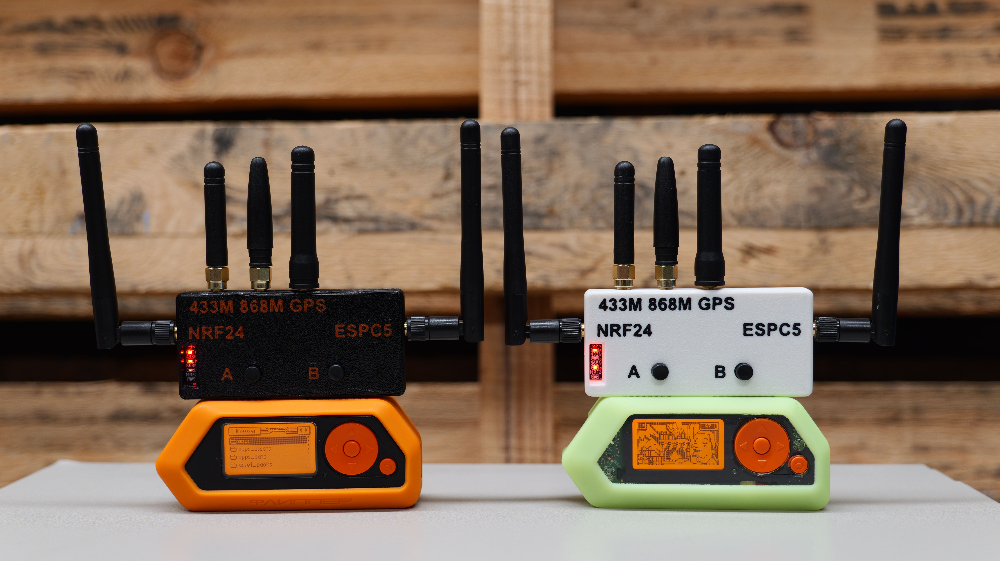
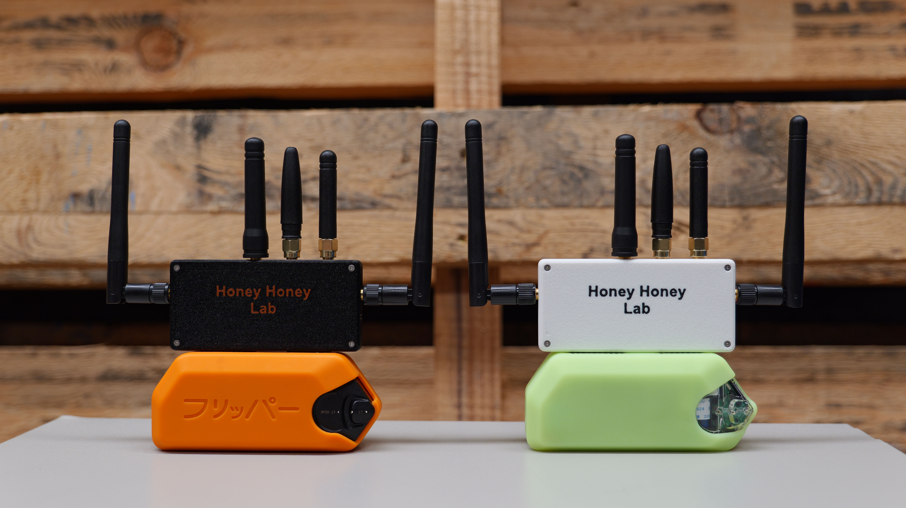
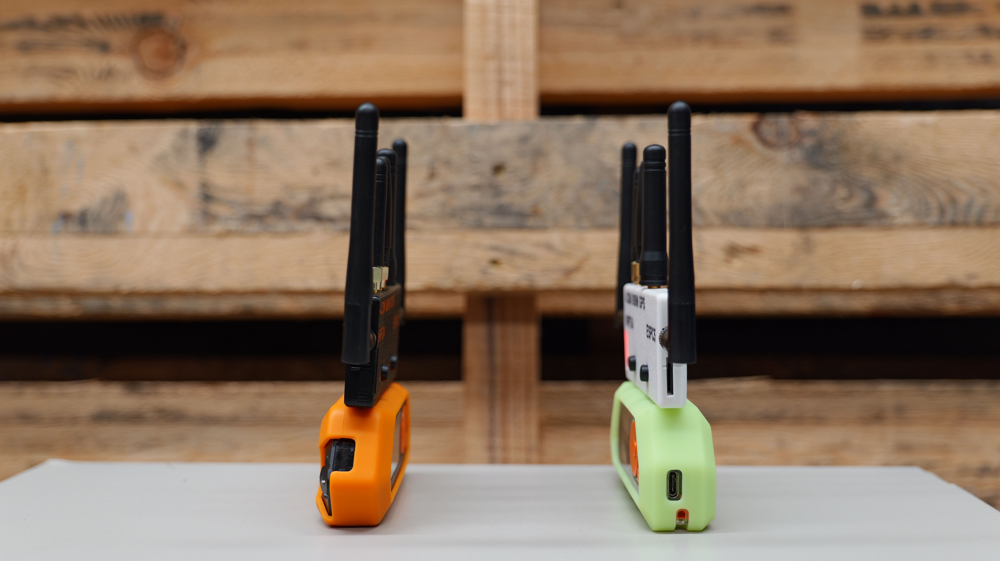
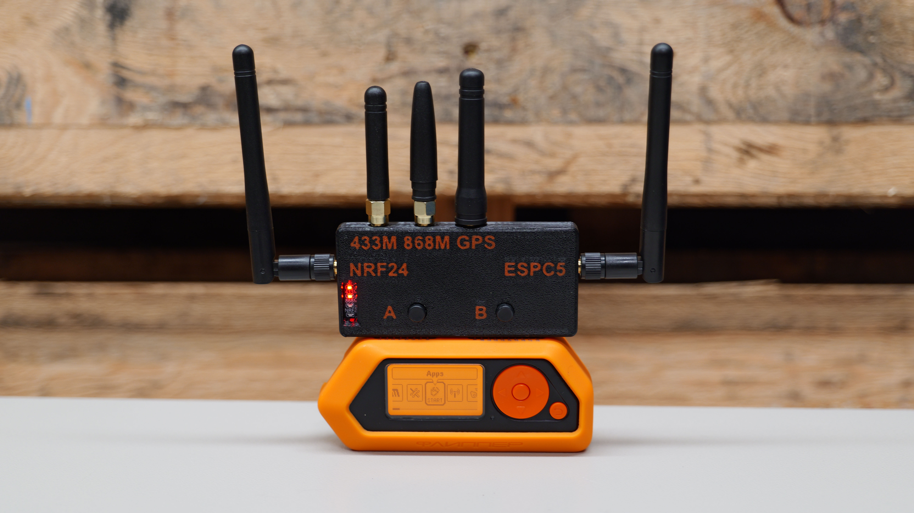
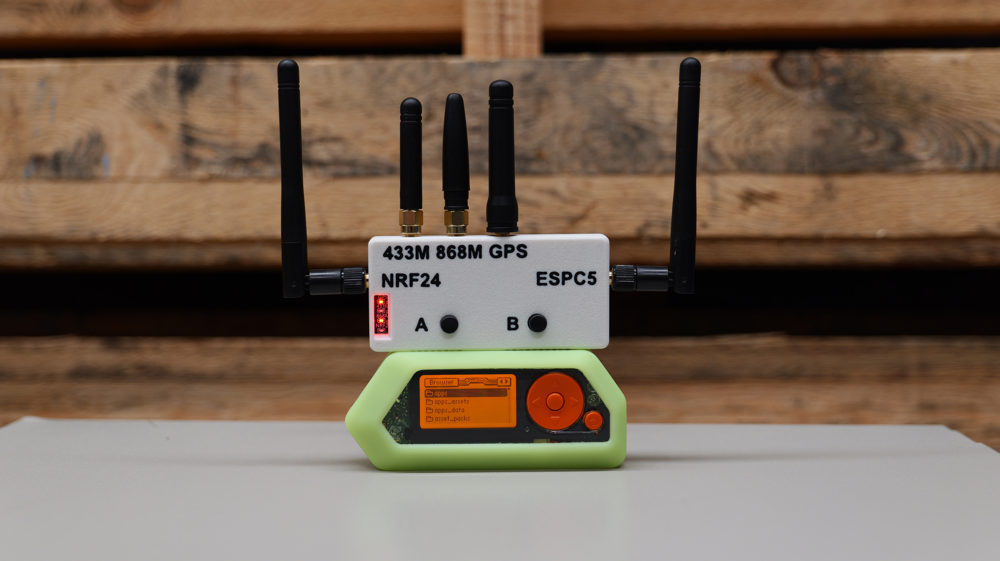
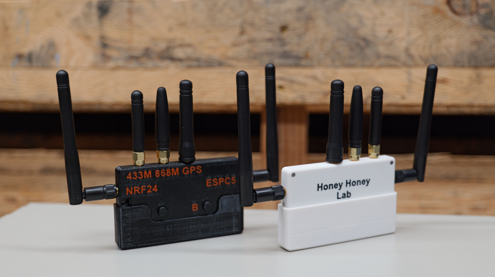
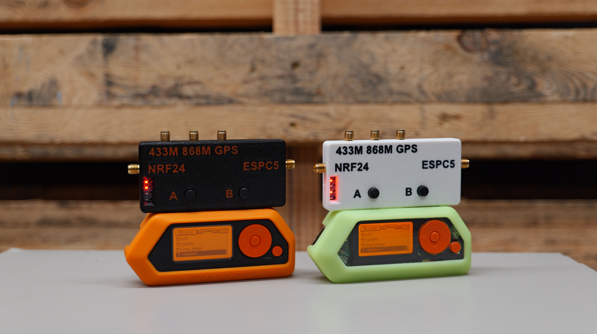
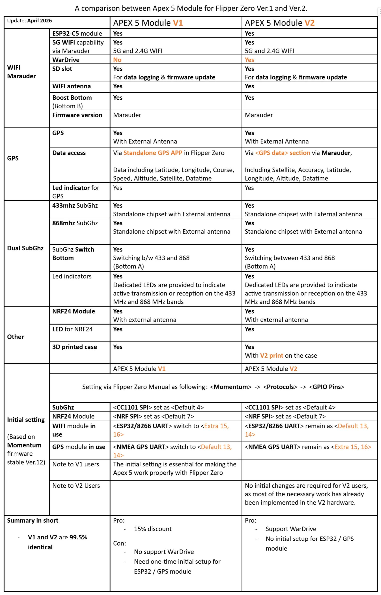

> [!NOTE]
> - Some chapters have been rewritten, while others have been reorganized to improve readability and understanding.
> - A new section, "Marauder Firmware Update via Micro SD Guide," has also been added - 08 July 2026.
>
> - Batch 2 units are now available. More Detail please check the in comparison chart - 12.April.2026 update.
>
> - Batch 1 units will be available to order on Tindie from 12 Feb 2026 and are scheduled to ship on Friday, 15 Feb 2026.
>   
> - 09 Feb 2026 — First version of this manual, by Anson C. @ Honey Honey Team
>
> - Batch 1 of the APEX 5 module does not support Marauder WarDrive. If WarDrive is essential for your application, please wait for Batch 2.
> 
> - All procedures and descriptions related to the Flipper Zero in this manual were validated using Momentum Firmware version MNTM-012 (30-04-2025).

 

  ## 1. What is Apex 5 Module
	
Apex 5 Module is Our latest creation for Flipper Zero. The 5 is **stand for 5 major functionality on board**, vastly extend the capability of flipper Zero. 
	
- ⚡ **ESP32-C5** running **Marauder** firmware, capable of handling **2.4GHz + 5GHz WiFi**
- ⚡ **Dual Sub-GHz modules** supporting **433MHz** and **868MHz** frequencies
- ⚡ **NRF24 Chipset** capturing, analysing, and transmitting raw 2.4GHz packet data
- ⚡ **Built-in GPS**
	
## 2. What Makes Apex 5 Module Special?
  
1️⃣ **Comprehensive & Powerful**

The **Apex 5 Module** combines the most popular expandable functionalities for the Flipper Zero into one compact and portable device. 
	
Compared to our **Double Barrel 5G** unit, the Apex 5 trims down to a single Marauder setup while still **retaining full 5GHz WiFi capability**. On top of that, it also integrates:
- ✅ Dual Sub-GHz modules
- ✅ NRF24 support

 

2️⃣ **User-friendly**

We designed Apex 5 not just for performance, but for ease of use:
- ✅ **Marauder firmware comes preloaded** — ready to use out of the box
- ✅ **Well-written manuals and demo videos** (just like our other products)
- ✅ **Responsive technical support** via WhatsApp and email

Whether you're new or experienced, you can get started quickly and confidently.

 

## 3. Specification

- 🌟 **Genius ESP32-C5 chipset** featuring ESP32 Marauder firmware with **5 GHz WiFi support**
  - 🔸 **8MB ram & 8MB flash** version for longevity / Upgradability
  - 🔸 **SDXC card slot** for saving PCAP and log files from Marauder (optional storage)
  - 🔸 **External antenna** for improved signal performance
  - 🔸 PCAP and log files can also be saved directly to the **Flipper SD card**
  - 🔸 **USB-C port and Boost Bottom** for upgrading firmware purpose (right-side button “B”)		

- 🌟 **Dual Sub-GHz chipset** with individual LED indicators
  - 🔸 One Sub-GHz chipset dedicated to **433 MHz**
  - 🔸 One Sub-GHz chipset dedicated to **868 MHz**
  - 🔸 **1 bottom** for switching between 433 and 868mhz Frequency (Left bottom / A)
  - 🔸 **2 LEDs** to indicate which frequency is currently active
  - 🔸 **Dual antennas** for optimal signal performance
 
- 🌟 **nRF24 chipset**
  - 🔸 Controlled via the **Flipper Zero app** (Channel Scan, MouseJacker, Scan, Sniffer, and other scripts)
  - 🔸 **Led indicator**
  - 🔸 **External antenna**
    
- 🌟 **GPS module** with external antenna
  
- 🌟 **Fully assembled 3D-printed enclosure** (pre-installed)

 

	
## 4. Package List / What’s Included
- 🔸  1 × Apex 5 Module
- 🔸  Pre-installed 2-piece 3D-printed enclosure (available in black or white)
- 🔸  **5 × Antennas** (please refer to Photo 4 for antenna types and their purposes)
- 🔸  **1 × Quick-start note** to help you get started and our contact for warrenty and technical suppoort

 

## 5.  Link to purhcase
- 🔸  Our Tindie shop - [Direct Purchase link](https://www.tindie.com/products/honeyhoneytrading/esp32-marauder-5g-apex-5-module-for-flipper/)
- 🔸  Our Official Shopify shop - Direct Link (In Progress)

 

	
## 6. Demo videos
- 🔸 **[Introduction to the Apex 5](https://youtu.be/tI_roxnqMi8)**, including initial setup, a quick Marauder walkthrough, and a demo of the dual Sub-GHz functions.
- 🔸 [**How to update Marauder firmware** on the ESP32-C5 chipset](https://youtu.be/umymbWbM4Ls). Further info will be covered in next chapter

 

	
## 7.1. Initial Setup Guide (Written Guide) for Apex 5 **Version 1 (V1)**

#### **GPIO Configuration Details For ESP32-C5 and CC1101 Subghz**

When you receive the Apex 5 Module, to ensure proper communication between the Flipper Zero and the Apex 5 Module — particularly the **ESP32-C5 and CC1101** chipsets — please configure the GPIO settings as shown in the animated diagram below.

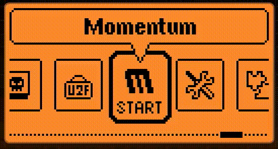

- 🔸  CC1101 SPI: Default 4
- 🔸  NRF24 SPI: Extra 7
- 🔸  ESP32 / ESP8266 UART: Extra 15, 16
- 🔸  NMEA GPS UART: Default 13, 14

## 7.2. Initial Setup Guide (Written Guide) for Apex 5 **Version 2 (V2)**

Unlike Version 1 (V1), the Apex 5 Version 2 (V2) does not require any initial setup. The V2 board is completely plug-and-play.

From a technical perspective, the major difference between V1 and V2 is the GPIO pin allocation. On the V2 board, we redesigned the GPIO mapping so that the Flipper Zero can communicate with both the ESP32-C5 and the GPS module simultaneously. This allows features such as Wardriving in the Marauder firmware to function correctly.

With the V2 board, the GPIO configuration on the Flipper Zero matches the default settings used by most Flipper Zero firmware, including the official firmware, Momentum, and Unleashed. As a result, no initial configuration is required for the vast majority of users. In other words, Apex 5 V2 board is compatible with most of Flipper Zero firmware. 

The GPIO settings should appear as shown below, which are the default values. Unless these settings have been modified previously, there is nothing you need to change before using the V2 board.

- 🔸  CC1101 SPI: Default 4
- 🔸  NRF24 SPI: Extra 7
- 🔸  ESP32 / ESP8266 UART: **Default 13, 14**
- 🔸  NMEA GPS UART: **Extra 15, 16**

  

  

#### **GPS Usage Note**

**1️⃣ For Version 1 (V1)**
If you would like to use GPS, the UART settings must be swapped between ESP32-C5 and GPS:

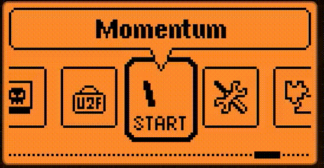

- 🔸  ESP32 / ESP8266 UART: Default 13, 14
- 🔸  NMEA GPS UART: Extra 15, 16

Additionally, the Apex 5 Module must be placed in an outdoor area, and a GPS antenna must be connected for proper GPS reception.

**2️⃣ For Version 2 (V2)**

If you would like to access GPS data, please use Marauder app, which is showed as following

Using Momentum firmware stable version 12 as example
- At Flipper Zero manual
- Go to <APP> - <ESP> - <Marauder> -
-  

 

## 8. How to Use Marauder Firmware & How to Update the Firmware (Written Guide)

#### 1️⃣  Our 2 cent on updating latest firmware.
	
When the Apex 5 Module is shipped, it comes **pre-loaded with the latest stable Marauder firmware**. For most users, it is **plug-and-play**.

While upgrading to a newer firmware may provide additional features, we do not recommend updating immediately after receiving the Apex 5 Module for first-time users, for the following reasons:

- Although the upgrade process may appear straightforward, **it can be challenging** if the required software environment has not been properly set up in advance.
- Newly released firmware versions may introduce bugs that have not yet been identified, it is the nature of rapid development / open-source. We generally recommend waiting around two weeks, as most users prefer stability and reliability over early access to untested features.
- Ignore this advice if you are an advanced user.

 

#### 2️⃣ Video Guide for upgrading via MicroSD card - updated 08.July.2026

⚠️ Important Notes
- 🔸  Only use firmware designed for **ESP32 C5 DevKit**. 
- 🔸  Using the wrong or corrupted firmware can brick your module.

Currently, the easiest way to update Marauder firmware is via Micro SD card. Here is the process. 

**1.	Download the correct firmware**
- Ensure the file matches your device. Here is a example: < esp32_marauder_v1_11_0_20260310_esp32c5devkitc1.bin >

**2.	Rename the file**
- Change the filename to: **update.bin**

**3.	Prepare the Micro SD card**
•	Format the Micro SD card as FAT32, if necessary. 
•	Copy update.bin to the root directory of the card (not inside any folder). 

**4.	Insert the SD card**
•	Place the card into the Apex 5 module’s MicroSD card slot.
•	If the module is no recognize the MicroSD card, using REBOOT option in the Marauder Manual.
•	Try a different MicroSD card if a MicroSD cannot be recognised by the device.

**5.	Start the update** 
•	Open the Marauder App on the Flipper Zero. 
•	Select the **firmware update** option and follow on-screen instructions.

#### 3️⃣ Video Guide for upgrading via USB-C

- 🔸  The lazy package, including **Flash Download Tool** from Espressif (Windows version), **Marauder firmware**, and **necessary binary (.bin) files**,  can be downloaded via: [this dropbox link](https://www.dropbox.com/scl/fi/i5mt078kky2rm4br7wxox/flash_download_tool_3.9.9_R2.For.Double.Barrel.5G.C5.Version.zip?rlkey=4fayfh5agvm8hhbbvkqv27oes&st=51wofks6&dl=0).

- 🔸  Alternaltely, you could download all individual files / software as following.

1. [ESP32.C5 firmware and BIN files](https://github.com/justcallmekoko/ESP32Marauder/tree/master/C5_Py_Flasher/bins), Link credit to [@JustCallmeKoko](https://github.com/justcallmekoko)
2. [Flash Download Tool](https://docs.espressif.com/projects/esp-test-tools/en/latest/esp32/production_stage/tools/flash_download_tool.html), Link credit to to Espressif aka the chip maker
3. [Upgrade Python Script if you are using Mac/Linux](https://github.com/justcallmekoko/ESP32Marauder/tree/master/C5_Py_Flasher), Link credit to [@JustCallmeKoko](https://github.com/justcallmekoko)
  
- 🔸  The Serial-USB function is based on FTDI. If your computer has trouble recognizing the serial port of the ESP32-C5, this driver might help: [FTDI driver](https://ftdichip.com/drivers/vcp-drivers/). Further technical info can be check [this link](https://docs.espressif.com/projects/esp-idf/en/latest/esp32c5/get-started/establish-serial-connection.html)

- 🔸  [The Update Video link via Youtube, pushlished by us](https://youtu.be/umymbWbM4Ls)
 

#### 4️⃣ Written Guide for upgrading via USB-C. The thorough version in a step-by-step fashion.

1. 🔸  The duide is based on **Flash Download Tool** on Windows
3. 🔸  Setup the tool as showed in the following two picture.
    
   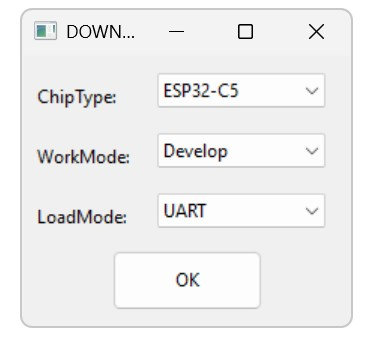
    
   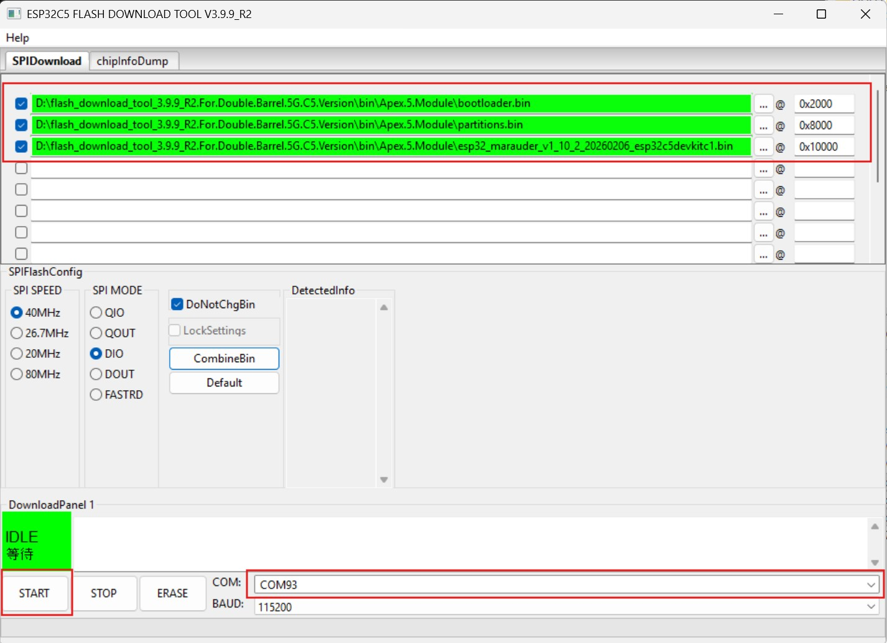
   
4. 🔸  While **holding down the BOOT button / B button** on the Apex 5 Module, connect the Apex 5 Module to your PC or Mac using the **USB-C port between the pins**.
5. 🔸  These two actions must be **performed simultaneously** — pressing and holding the boot button while connecting the Module / powering on is the standard procedure for entering bootloader mode on the device.
6. 🔸  If your computer recognizes the **ESP32-C5** chipset, a **COMxx** port should be available for selection in the Flash Download Tool.
7. 🔸  Next, click **Flash**. Allow the application to run for a few seconds until the process is complete. When finished, the screen should appear as shown in the following image.
   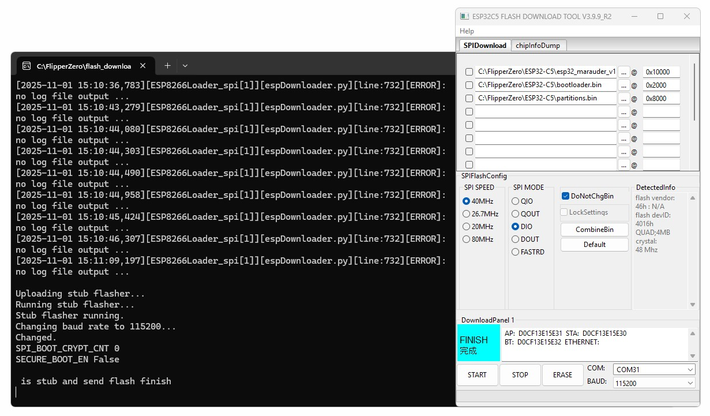

#### 5️⃣ known issues and solutions 

In some cases, the ESP32-C5 may fail to boot or respond to Marauder after a firmware update. Repeating the upgrade process usually resolves this issue — simply **perform the same firmware update again**.

At this time, the root cause of this behavior is unknown.

 

## 9. How to Utilize Sub-GHz (Written Guide)

- 🔸  **Button function**: The (A) button is used to switch between Sub-GHz 433 MHz and 868 MHz modes. The individual LEDs (433mhz and 868mhz) on the left will also switch accordingly when the button is pressed.
- 🔸  **Important**: The switch must be set before opening the Flipper Sub-GHz app. Otherwise, the app may freeze and the Flipper will need to be rebooted (Press and hold the LEFT and RETURN buttons at the same time).
- 🔸  **Frequency matching**: The Sub-GHz frequency must be configured correctly in both the Apex 5 Module and the Flipper app. For example, if the target frequency is 433.88 MHz, set the Apex 5 Module to 433 MHz, and then set the Sub-GHz frequency in the Flipper app to 433.88 MHz.

 

